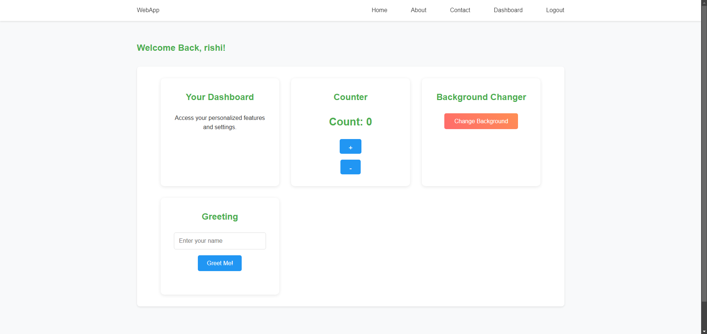

# My Web Page Project

A modern web application with user authentication and interactive features.



## Features

### User Authentication & Management
- User Registration
- User Login/Logout
- Session Management
- Secure Password Hashing
- Profile Settings Management
  - Custom Profile Picture Upload
  - Automatic Random Profile Pictures
  - Profile Picture Removal/Reset
- User Dashboard

### Interactive UI
- Responsive Design
- Dynamic Navigation
- Feature Cards
- Interactive Dashboard
- Profile Management Interface
- Modern CSS Animations
- Dynamic Profile Picture Updates

## Features in Development

- [x] User Profile Management
- [x] User Dashboard
- [x] Profile Picture System
- [ ] Password Reset Functionality
- [ ] Email Verification
- [ ] Admin Dashboard
- [ ] User Activity Logging

## Tech Stack

- **Frontend:**
  - HTML5
  - CSS3
  - JavaScript
  - Bootstrap
  - Font Awesome Icons

- **Backend:**
  - PHP
  - MySQL
  - PDO Database Connection

- **Development Tools:**
  - Git
  - XAMPP
  - Visual Studio Code

## Project Structure 🗂️

```
my_web_page/
├── src/
│   ├── assets/
│   │   ├── img/         # Folder for images
│   │   │   ├── default-avatar.png
│   │   │   ├── picture.png
│   │   └── styles/
│   │       ├── components.css        # Component-specific styles
│   │       ├── main.css              # Main styling
│   ├── components/
│   │   └── navbar.php                # Navigation bar component
│   ├── js/
│   │   ├── main.js                   # Main JavaScript functionality
│   │   └── profile-settings.js       # Profile settings specific JS
│   ├── php/
│   │   ├── auth/                     # Authentication functionalities
│   │   │   ├── login.php             # Login processing
│   │   │   ├── logout.php            # Logout handling
│   │   │   ├── register.php          # Registration processing
│   │   │   └── update-profile.php    # Profile updates
│   │   ├── config/                   # Configuration files
│   │   │   └── database.php          # Database configuration
│   │   ├── profile_picture/          # Profile picture functionalities
│   │   │   └── update_profile.php    # Handles profile picture updates
│   │   ├── utils/                    # Utility functions
│   │   │   └── profile_utils.php     # Profile picture utility functions
├── index.php                         # Main entry point
├── login.html                        # Login page
├── register.html                     # Registration page
├── dashboard.php                     # User dashboard
├── profile-settings.php              # Profile management
├── README.md                         # Project documentation
└── LICENSE                          # License file
```

## How to Run

1. Clone this repository
2. Open `index.html` in your web browser

## Features

- Responsive design
- Interactive button
- Custom styling

## Author

Rishi Bardoliya

## License

This project is open source and available under the [MIT License](LICENSE).

## Setup Instructions

1. **Prerequisites:**
   - XAMPP installed
   - Git installed
   - Web browser

2. **Installation:**
   ```bash
   # Clone the repository
   git clone https://github.com/Rishi-1010/my_web_page.git

   # Move to project directory
   cd my_web_page
   ```

3. **Database Setup:**
   - Start XAMPP Apache and MySQL services
   - Create a new database named 'webapp_db'
   - Import the database structure from `database.sql`

4. **Configuration:**
   - Update database credentials in `src/php/config/database.php`
   - Ensure proper file permissions

5. **Access the Application:**
   - Open your browser
   - Navigate to: `http://localhost/GIT/my_web_page/`

## Features in Development

- [x] User Profile Management
- [x] User Dashboard
- [ ] Password Reset Functionality
- [ ] Email Verification
- [ ] Admin Dashboard
- [ ] User Activity Logging

## Git Branches

- `main` - Production ready code
- `feature/user-authentication` - Authentication system
- `feature/dashboard` - User dashboard implementation
- `feature/profile-settings` - Profile management system
- `development` - Latest development changes

## Contributing

1. Fork the repository
2. Create your feature branch (`git checkout -b feature/AmazingFeature`)
3. Commit your changes (`git commit -m 'Add some AmazingFeature'`)
4. Push to the branch (`git push origin feature/AmazingFeature`)
5. Open a Pull Request

## License

This project is licensed under the MIT License - see the [LICENSE](LICENSE) file for details.

## Acknowledgments

- Bootstrap Documentation
- PHP Documentation
- Font Awesome Icons
- XAMPP Team

## Contact

Rishi Bardoliya - rishibardoliya@gmail.com
Project Link: [https://github.com/Rishi-1010/my_web_page](https://github.com/Rishi-1010/my_web_page)